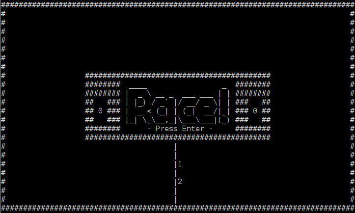

Race!
=====
`3,2,1... Go!!!`



How to run
----------

### Windows

* Download and install [wget](http://sourceforge.net/projects/gnuwin32/files/wget/1.11.4-1/wget-1.11.4-1-setup.exe/download)
* Open command prompt
* Go to the directory where you want Cygwin installed
* Install and start Cygwin:

>```bat
setx PATH "%PATH%;C:\Program Files (x86)\GnuWin32\bin"
wget --no-check-certificate https://cygwin.com/setup-x86_64.exe
mkdir cygwin
setup-x86_64.exe --quiet-mode --no-shortcuts --site http://cygwin.mirror.constant.com --root %cd%\cygwin -P git -P gcc-core -P libgcc1 -P libclang-devel -P make -B
cygwin\Cygwin.bat
```

* Once in Cygwin, run the UNIX commands to start the game

### UNIX
```bash
git clone https://github.com/gto76/race.git
cd race
./run
```


